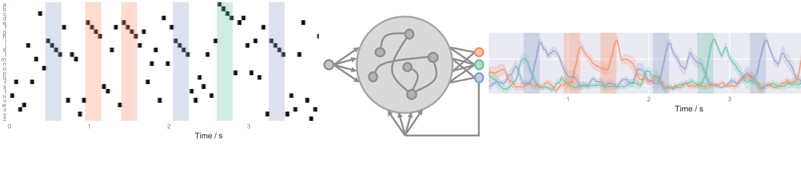
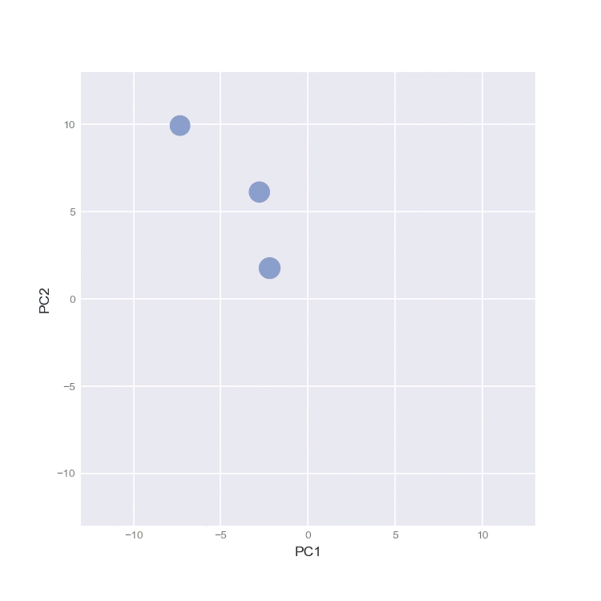
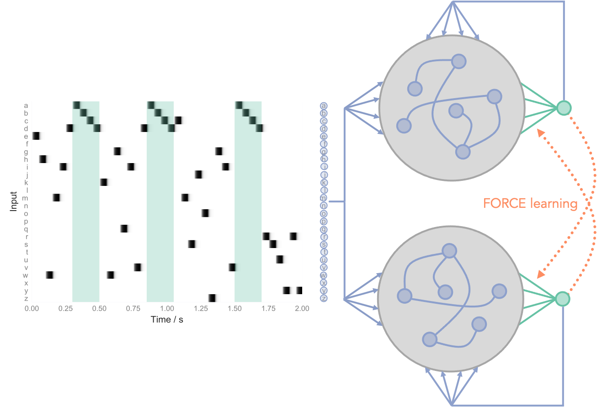

# ReservoirComputing
Code for computing with reservoir nets, pairs of mutually supervising reservoir nets and training with FORCE learning. Produced for PhD rotation in Akrami Lab studying temporal structure learning. This is an extension to the work originally produced by [Asabuki and Fukai (2018)](https://journals.plos.org/ploscompbiol/article?id=10.1371/journal.pcbi.1006400). For the most detailed write up of my work, see [finalPresentationSlides.pdf](./finalPresentationSlides.pdf).

There are two main classes at the heart of this project: a `reservoir` network class which builds a classic rate-based reservoir network which can be trained to match a target function via FORCE learning. A `reservoirPair` class which pairs two reservoirs and trains them to predict each others output. This was shown by Asabuki and Fukai (2018) to be a good way to learn to perform 'chunking' of repeated stimuli. In this work I extend this showing the architecture and learning rule are capable of a broader class of statistical learning technique. I investigate the mechanisms for how they work include the intruging role of chaotic dynamics. 

## `class reservoir()`. 
A reservoir network trained to perform chunking on 3 repeating sequences. 

Movie shopwing the first 2 PCA on the internal representations for inputs drawn from Scapiro et al. (2012) random walk environment. Note attractor-like dynamics.

## `class reservoirPair()`

A pair of reservoir networks. Each recieve the same input stream and are trained to predict the output of each other by FORCE learning. 

